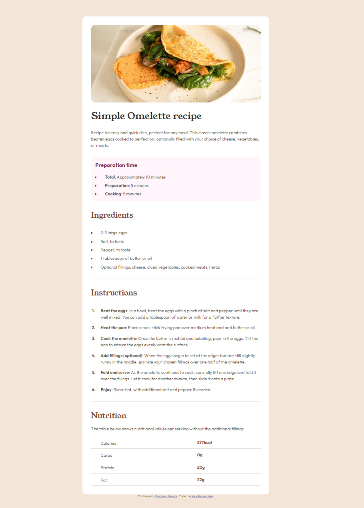
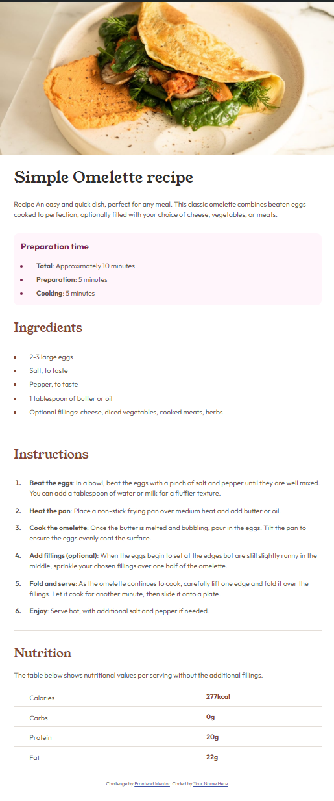

# Frontend Mentor - Recipe page solution

This is a solution to the [Recipe page challenge on Frontend Mentor](https://www.frontendmentor.io/challenges/recipe-page-KiTsR8QQKm). Frontend Mentor challenges help you improve your coding skills by building realistic projects.

## Table of contents

- [Overview](#overview)
  - [The challenge](#the-challenge)
  - [Screenshot](#screenshot)
  - [Links](#links)
- [My process](#my-process)
  - [Built with](#built-with)
  - [What I learned](#what-i-learned)
  - [Continued development](#continued-development)
  - [Useful resources](#useful-resources)
- [Author](#author)
- [Acknowledgments](#acknowledgments)

## Overview

### Screenshot

### Links

- Live Site URL: [Recipe page](https://jewebdev.github.io/recipe-page/)

## My process

### Built with

- Semantic HTML5 markup
- CSS custom properties
- Flex box
- Mobile-first workflow

### What I learned

This project was fun, i learned a lot:

- Until now i have learned that starting with the mobile-first approach is easier than desktop-first.

- min-width in media queries is for when the screen is that size or larger
  max-width is when the screen size that size or shorter.

- The breakpoints are decided by the content, not the devices, it's better to make a breakpoint where the design breaks, rather than making it for a specific device width.

- I learnt how to use downloaded fonts with @font-face in css.

- I tried to follow the DRY principle the best that i could. Creating utility classes for styles that i used repeatedly.

### Continued development

I still have a lot to learn but it was a fun and rewarding design to build. im hoping to level up my css and html skills by making tons of projects.

### Useful resources

- [MDN Web Docs](https://developer.mozilla.org/es/) - This is my primary source when searching how to use css properties and html tags.

- [web.dev](https://web.dev/articles/css-marker-pseudo-element) - This article helped me understand how to style the bullet points for the li elements.

## Author

- Website - [Juan Esparza](https://www.your-site.com)
- Frontend Mentor - [JEWebDev](https://www.frontendmentor.io/profile/JEWebDev)

## Acknowledgments

To the frontend mentor team: Thank you, your designs are awesome and very helpful. it makes learning more rewarding by building amazing looking sites.🚀
